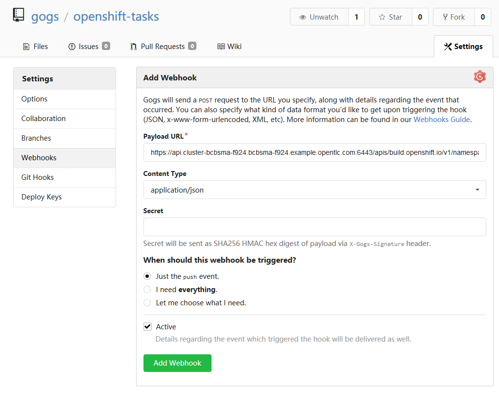
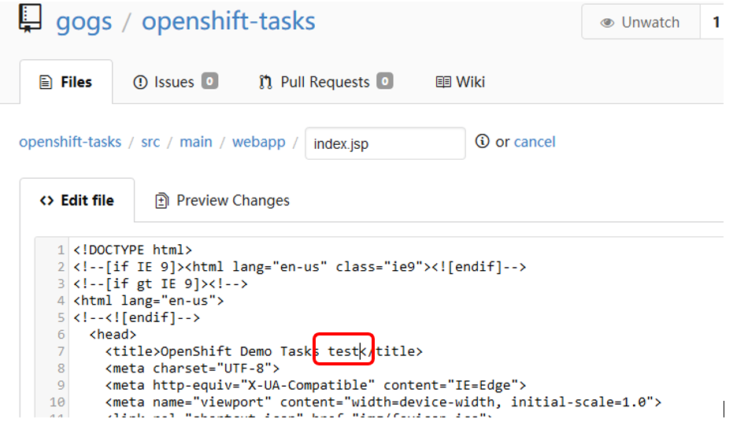

[[creating-a-pipeline]]
### Creating a Pipeline

In this lab, we will learn to create a build pipeline on OpenShift. This
pipeline will be setup using Jenkins running as an application pod on
OpenShift. The pipeline running on Jenkins will trigger builds and
deployments on OpenShift.

*Step 1:* Open a terminal window and use the following command to clone the following Github repository.  Then change directory into the new folder.

....
$ git clone -b ocp-4.2 https://github.com/jimgarrett123/openshift-cd-demo.git
$ cd openshift-cd-demo
....

*Step 2:* If you haven't already done so, use the Openshift Command Line Interface to login to your account:

....
$ oc login https://<your_openshift_website>:6443 -u <your_username> -p openshift
....

*Step 3:* Execute the script, "scripts/provision.sh", to provision the environment.  This script will create 3 new projects named cicd-user, dev-user and stage-user respectively.  In addition, it will deploy several containers into the cicd-user project.

....
$ ./scripts/provision.sh deploy
....

*Step 4:* Login to the Openshift console using the same userid, and click on the *Home->Projects* tab.  You should see the following Projects.

*Step 5:* In the upper left corner, select the pulldown menu next to "Administrator" and select *Developer*.  This will take you to the Developer tab where you can view the containers and watch them provision.  To view this click on the *Topology* tab.

*Step 6:* Wait for all the containers to start. You should see the circle surrounding the container displayed in a deep blue color when they start.  The following image shows the available containers.  Notice that some containers have a small icon in the upper right section of the circle.  This implies the container has a route defined, which makes the container accessible from the outside world.

The following containers are found in this deployment:

****
* jenkins   - provides the ci-cd pipeline
* gogs      - provides a Github like source code repository
* sonarcube - tool that is used to analyze source code and check for issues
* nexus     - used to store artifacts, like war and ear files that are produced during a build
****

*Step 7:* Click on the *route* for the jenkins container.  This should launch a new browser window.  The following screens should be seen when doing this:

Jenking Login page.  Click on the *Log in with Openshift* button to login.  Use the same userid and password used in Openshift.  After using the Openshift login page you should also be presented with a page that requests you to *Authorize Access*, click on the *Allow selected permissions* button to provide this.

*Step 8:* Back in Openshift, click on the *Builds* tab.  This should display the *Build Configs* page on the right, and on this page you should see the *tasks-pipeline*.

image:images/build_configs_task_pipeline.png[build_configs_task_pipeline.png]

Go ahead and click on the *tasks-pipeline* link.  On the tasks-pipeline screen you can see everything about the pipeline.  On the right side of the screen is the actual build pipeline.  Go ahead and scroll down to see what it does.

At the very bottom of the screen is the *Webhooks* section.  Webhooks literaly provide hooks back into the pipeline from outside of Openshift.  Locate the *Generic* webhook and click on the *CopyURL with Secret* link.  This will copy the link into your clipboard.

*Step 9:* Back in Openshift, click on the *Topology* tab to display the containers, then click on the *route* for the *gogs* container.  This should launch a new screen taking you to the gogs login.  Click the *Sign in* button and login where the credentials *gogs/gogs*.

On the right side of the Gogs screen, notice the *My Repositories* section, and notice there is one repository named *openshift-tasks*.  Click on this repository.

*Step 10:*  In the gogs/openshift-tasks repository, click on the *Settings* icon in the upper right corner.

*Step 11:* On the *Settings* screen click on the *Webhooks* tab on the left to display the list of available Webhooks.  Then click on the *Add Webhook* button.  Select the *Gogs* type of webhook.

*Step 12:* On the *Add Webhook* page populate the *Payload URL* with the Webhook that was copied from the Openshift build pipelie.  Make sure *Content Type* has the value *application/json* and then click the *Add Webhook* button.

*Step 13:* Go back to the *openshift-tasks* source code and select the *eap-7* source code branch.

*Step 14:* With Brans eap-7 selected, navigate down to the following source code path: *src/main/webapp* and then select the file *index.jsp*.  In the upper right corner of the file click on the *pencil* icon to edit the file.

*Step 15:* At the top of the file locate the *title* section and add the work *test* to the title.  Then scroll down to the botton and click the *Commit Changes* button.  The action of changing and saving this file should kickoff a pipeline build in Openshift

*Step 16:* Back in Openshift, click on the *Builds* tab on the left, and then select the *Builds* tab on the page.  This will display the pipeline build that was just initiated.  Click on the *tasks-pipeline-1* to watch the build.  The build should taks approximately 8 minutes to finish.

*Step 17:* A successful pipeline build looks like the following.  Notice that the final step conveys the *Input Required*.  To finish this step click on the *Input Required* icon to jump into Jenkins.

On the left, locate and click on the *Paused for Input* link.

Then on the *Promote to STAGE?* screen click the *Promote* button.  After doing so go back into Openshift to watch the build pipeline finish.

*Step 18:*  The final step is to verify that the build pipeline actually deployed the code.  You should be able to navigate to either the *dev-user* or *stage-user* project and see a container running.  Click on the route for the container to launch a new window into the running application.

