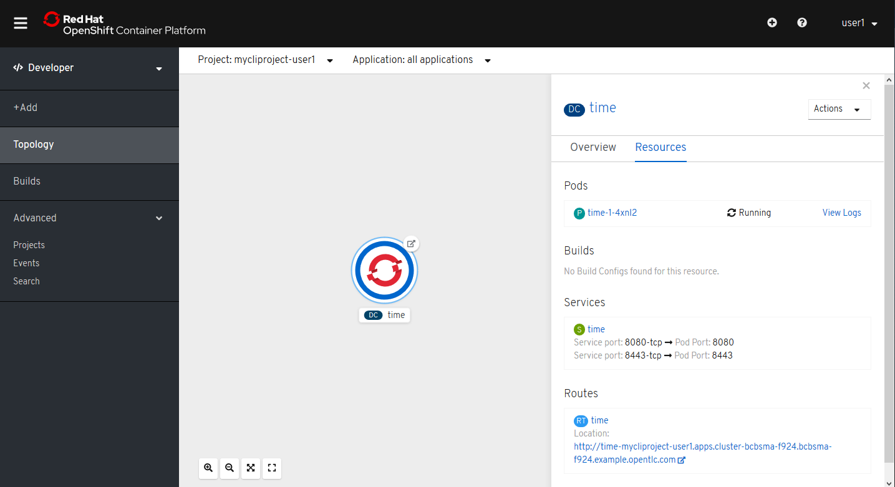

[[using-web-console]]
Using Web Console
~~~~~~~~~~~~~~~~~

In this lab exercise, we will review the OpenShift Web Console.

Type in the master public URL provided by your instructor in a browser.
Use `<master public URL>:<port>`. You will be directed to an OpenShift
login page.

*Note*: Your browser may complain about the server’s security
certificates not trusted by your computer. You can agree to proceed to
the master URL.

image:images/login.png[image]

Key in the username and password provided by the instructor. You will
see the list of projects now. Locate your project in the list.

Also note the *Create Project* button which allows you to create a new
project from Web Console.

Now, in the upper left hand side of the window, click on the triangle next
to *"Administrator"* and then select *Developer*.

On this page, the default view is *Topology*.  In the panel on the right
you should see the *time* pod running.

When you select the *time* pod it will display a panel to the right that
contains the *Overview* and *Resources* panels.

In the *Resource* panel you can see that a single pod is
running and is front ended by a service. Note the route that you
configured for this service is also shown.

Select *Builds* under *Builds* tab, you will see all the build
configurations. Select the *time* Build Config, we will be able to view all the build details.

If you scroll down to the bottom notice there are webhook
URLs. We will use them in a later lab exercise.

Before going to the next lab, let's clean up your project and delete the components.

....
$ oc delete all --all
$ oc delete project mycliproject-UserName
....

link:4_Creating_an_application_using_JBoss_EAP_builder_image.adoc[Next Lab]

link:README.adoc[Table Of Contents]
