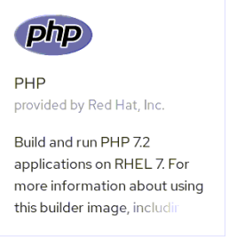

[[using-templates]]
Using Templates
~~~~~~~~~~~~~~~

In this lab exercise we will learn how to use OpenShift Web Console to
spin up a MySQL database using templates. We will then add a frontend
PHP application that accesses this database using the service exposed by
the database. We will provide a route (a URL) to access the frontend
application from a browser.

*Step 1: Create a Project*

Based on the experience gained from the previous exercise, log into the
OpenShift Web Console. You will see the list of Projects.

Using the *Create Project* button, create a new project. We will call it
*consoleproject-UserName*. Replace by your username to make this project
unique. Type in a *Display Name* and *Description* of your choice.

Press the *Create* button to complete the project creation from the Web
Console. This will accomplish the same job as `oc new-project` from CLI.

*Step 2: Create a MYSQL database using the template*

Click on *Add to Project -> Browse Catolog* button

In the "*Search Catalog*" field type '*mysql*'

Find *MySQL* template from the list and click *Select*. 
You will also notice *MySQL (Persistent)* template. But we will address 
that in a different lab exercise.

On the "*Information*" page, click the "*Next*" button.

You will be taken to the mysql ephemeral creation screen. 

Edit the values to use the following values:

....
Database Service Name:     mysql
MySQL Connection Username: pricelist
MySQL Connection Password: pricelist
MySQL root user Password:  pricelist
MySQL Database Name:       pricelist
....

Click the "*Next*" button

On the "*Binding*" page click the *Create* button.

Naviagete back to the project overview page and soon you will see
an image of a running pod.

image:images/mysql_pod_on_proj_overview.png[image]

*Step 3: Add data to MySQL database*

Let us see how we can enter the pod and access the database.

From the command line, change the project to the
`<your_project>` using the following command:

----
$ oc project <your_project>
----

Based on what you learned previously get the list of running pods by running:

----
$ oc get pods
----

You will find one pod for mysql running. Take a note of it's name.

Enter the pod by running the following command. Substitute the pod name
with your mysql pod name.

----
$ oc rsh mysql-1-aewve

bash-4.2$
----

You will be taken to a bash prompt inside the running pod. Now using the
service ip address you noted earlier, port number, username and password
you used start the mysql client as shown below. You will have to
substitute your values here.

TIP: If you need service ip address navigate to *Applications->Services* tab on the Web Console.

[source,sh]
----
mysql -h127.0.0.1 -P3306 -upricelist -p
----

You will be taken to the `mysql` prompt. See the list of databases. You
will notice that the sample database that you requested is added and
available.

[source,sh]
----
mysql> show databases;
+--------------------+
| Database           |
+--------------------+
| information_schema |
| pricelist          |
+--------------------+
2 rows in set (0.00 sec)
----

Change over to use the `pricelist` database.

[source,sh]
----
mysql> use pricelist;
Database changed
----

Now `show tables` shows an empty set. So let us create a table and add
some records using the commands shown below.

Create the table:

[source,sql]
----
create table users (user_id int not null auto_increment, username varchar(200),PRIMARY KEY(user_id));
----

Now we add some data:

[source,sql]
----
insert into users values (null, 'joe');
insert into users values (null, 'alice');
----

Verify that the records you added are there:

[source,sql]
----
select * from users;
----

Now `exit` MySQL client and `exit` out of the pod.

*Step 4: Add a PHP frontend to talk to this database*

In this step we will add a PHP frontend application that talks to
recently created database. The code is available on github at
https://github.com/RedHatWorkshops/php-pricelist

Browse through the code in this repository. If you take a look at the
link:https://raw.githubusercontent.com/RedHatWorkshops/php-pricelist/master/config/database.php[database configuration] file (`config/database.php`) you will see that it reads the values from environment varables.

To add a new application click on *Add to Project*. It takes you to
Search Catalog page where you choose the *PHP* template.

Enter the following values for each parameters:

....
* Name: pricelist
* Git Repository URL: https://github.com/RedHatWorkshops/php-pricelist
....

Click *Create* to add this application.

Navigate back to the Project Overview page and you will 
see the new service is now available and exposed as a route.

You will also notice that a build starts running very soon. Once the
build completes, the application image created from the source code will
be uploaded to the docker repository.

image:images/console_project_overview.png[image]

You can check the build logs using the following command:

....
$ oc logs build/pricelist-1
Cloning "https://github.com/RedHatWorkshops/php-pricelist" ...
	Commit:	2aa50442e8432c48beedc1503cd3d05dcb834515 (Added db connection)
	Author:	Christian Hernandez <christian.hernandez@yahoo.com>
	Date:	Thu Jun 29 10:52:43 2017 -0700
---> Installing application source...
Pushing image docker-registry.default.svc:5000/consoleproject-christian/pricelist:latest ...
Pushed 0/6 layers, 2% complete
Pushed 1/6 layers, 26% complete
Pushed 2/6 layers, 42% complete
Pushed 3/6 layers, 56% complete
Pushed 4/6 layers, 75% complete
Pushed 5/6 layers, 97% complete
Pushed 6/6 layers, 100% complete
Push successful
....

Once the build completes, OpenShift initiates a deploy process. Once the
deployment is complete, the frontend pod starts running. 

Prior to testing the application we need to first define some Environment Variables.

From the Project page navigate to the 'pricelist' configuration page by clicking on the 'pricelist' project.

Click on the Environment tab to see a list of environment variables.

Add the following Environment variables to the application:

....
MYSQL_SERVICE_HOST : mysql
MYSQL_SERVICE_PORT : 3306
MYSQL_DATABASE     : pricelist
MYSQL_USER         : pricelist
MYSQL_PASSWORD     : pricelist
....

Then click the "Save" button to commit the variables.

Next navigate back to the Project page by clicking the "Overview" link on the left.

The Pricelist application will redeploy after changing the Environment variables.  

When complete click on the *Route* for the application.

Initially the webpage will not contain any data.  There is a webpage that can be used to instantiate and populate
the database tables.

Using the Route, add the *create_database.php* to the end, and execute the page.  Then click your back button.

The application should display in the Browser.  Click the *+Create Record* button and create a new Record.

Then click on the *Read Records* button to return to the main page, you should see your new record.

link:6_Scale_up_and_Scale_down_the_application_instances.adoc[Next Lab]

link:README.adoc[Table Of Contents]
